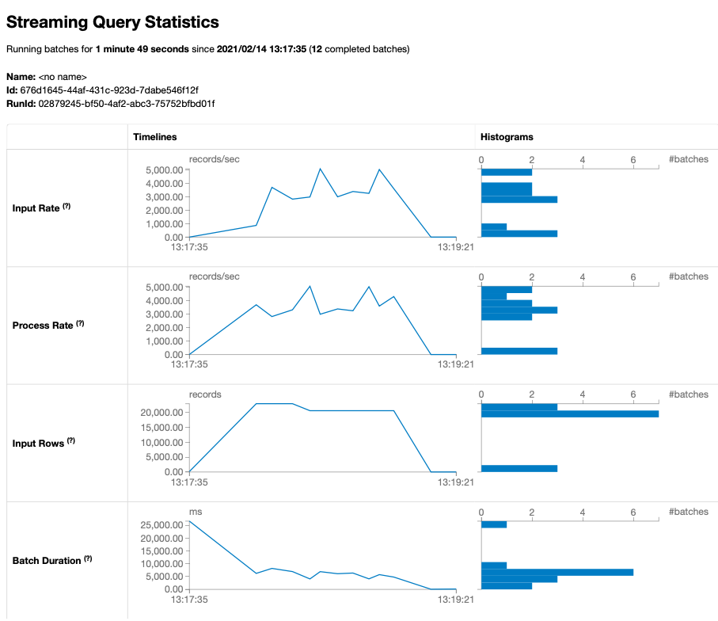
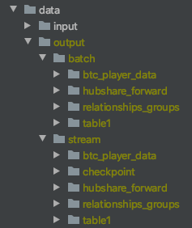

# Batch and stream processing in Spark

## Starting Apache-Spark docker cluster
To better illustrate the inner working of Spark engine, it's best to run Spark in cluster mode using Docker containers.
Start Spark master and worker nodes as per the configuration in the `docker-compose.yml` file as follows
```shell script
docker-compose up --scale spark-worker=3 # the template allows for up to 10 workers which are enough in local setting
```
This creates a virtual network `spark-network` and instantiate one master container and three workers inside the network
with pre-installed and configured scala, spark, hadoop and associated networking setting for the cluster to be 
functioning. Now you can go to Spark master UI at http://localhost:8080 where you can find real time information about
ongoing Spark applications submitted to the cluster through the master node.

## Testing by submitting an example application to Spark. 
It's good to test the deployment using one of the examples included with Spark installation. You can do so by connecting
to the master node and run a Spark example as follows
```shell script
spark-submit --master spark://spark-master:7077 --class org.apache.spark.examples.SparkPi \
/usr/local/spark/examples/jars/spark-examples_2.12-3.0.1.jar 1000
```
The jar's name is formulated with Scala and Spark version numbers hence make sure you change the name according to the
versions declared in [Dockerfile](./Dockerfile)

## Submitting our application 
Once the deployment has be tested successfully, we can run our own application same as with testing but first we need to
build the jar using
```shell script
sbt package
```
which will produce the `spark-docker-setup_2.12-0.1.jar` in the `./target/` folder. This folder is mounted to each of 
the docker container in the Spark cluster hence once built, the jar can be immediately accessed from any of the node.
Again on the master node, run our application with
```shell script
spark-submit --master spark://spark-master:7077 --class spark.streaming.example.Application \
/app/spark-docker-setup_2.12-0.1.jar
```
This application will run a `BatchJob.run()` followed by a `StreamJob.run()`, which perform the same transformations 
implemented in `spark.streaming.example.Transformations` in batching and streaming fashion respectively. This example 
illustrates Spark's ability to share business logic's implementation across different processing contexts.

The root logger in Spark has been set to `WARN` level to suppress logging during job run. The Spark UI can provide 
better insight into the detailed queries generated by our application


Or specifically with streaming job, this shows the traffic pattern when the streams are reading one file at a time from
the `./data/input` folder.



Both the batch and streaming job are writing data to `./data/output` folder with different partitioning strategies for
each dataset. 



where `./data/output/<batch, or stream>/table1` contains the output for the consolidated table described in Task #1 and
the other folders next to it containing data for the sub-tables mentioned in Task #2.

Task #2 mentioned doing an upsert operation in Spark, however it's not clear at the moment which columns are the primary
keys for indexing purpose. A custom function to perform Upsert operation in Spark is provided in 
`spark.streaming.example.Transformations.upsertUnion` for illustration purpose. Once the business context around this
is clarify, it would be straight forward to apply this function to fulfill the requirements.
